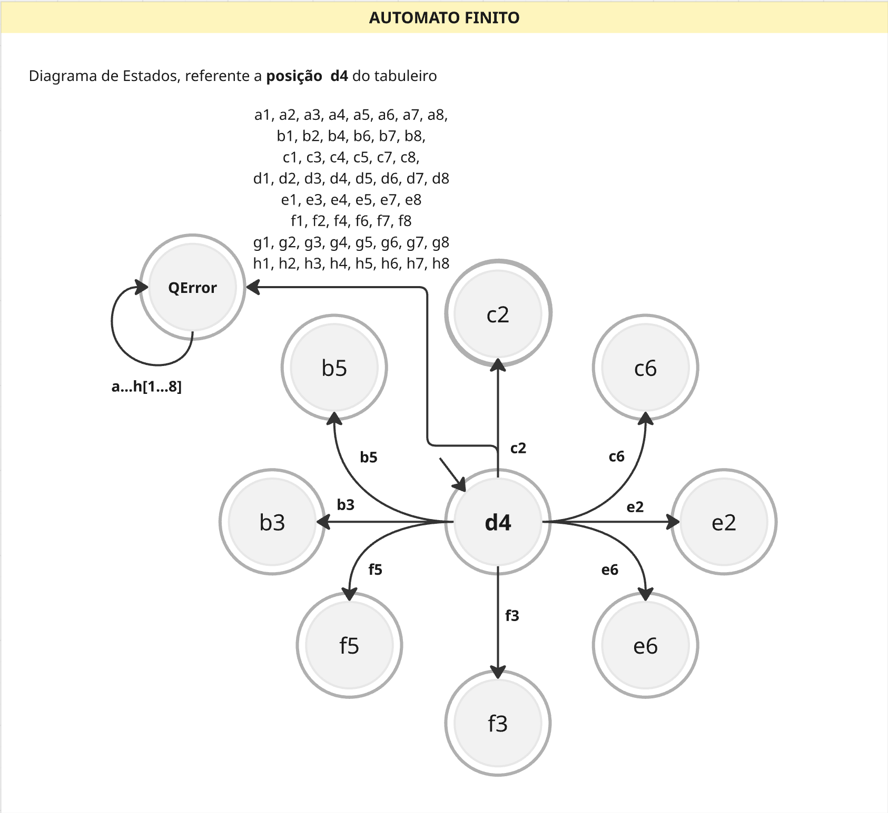

# Projeto de Knight Rider 
**Anna Carolina Rezende Garrido, 10443894**

## Funcionamento:
O código do validador funciona com base em uma matriz de transição, criada e alimentada pelo algoritmo a partir de validações matemáticas que verificam se cada movimento da cadeia de entrada respeita o padrão em "L" do Cavalo no tabuleiro.

### Matriz de Transição
O primeiro passo é a estruturação da matriz de transição $\delta$, que é a base de todo o projeto. 
Considerando que o tabuleiro de xadrez possui 64 casas possíveis ($8\times8$), a matriz possui 64 colunas e 65 linhas. As 64 linhas base representam cada estado operacional e a linha adicional representa o estado de erro ($q_{err}$), funcionando como um estado de "poço" (sumidouro).

Para cada posição da matriz, a função **popular_automato()** verifica se, a partir da origem (linha), é possível chegar ao destino (coluna) simulando o comportamento do tabuleiro real:

#### Cálculo Comparador:
Para comparar o par de posições, comparamos a variação de cada coordenada individualmente ($dx$ para colunas e $dy$ para linhas) utilizando valor absoluto, de forma que para ser válido:

**C1 (Salto Vertical Longo):**
* A diferença entre as linhas (eixo Y) precisa ser igual a **2**.
* A diferença entre as colunas (eixo X) precisa ser igual a **1**.

**C2 (Salto Horizontal Longo):**
* A diferença entre as linhas (eixo Y) precisa ser igual a **1**.
* A diferença entre as colunas (eixo X) precisa ser igual a **2**.

É importante ressaltar que as movimentações válidas em cada um dos casos podem ocorrer para qualquer direção. O código trata essas variações através da função `abs()`, garantindo que apenas a distância do deslocamento seja considerada.

Caso o estado final seja alcançável através do estado inicial pela métrica de 2:1 ou 1:2, a posição analisada é preenchida com o índice do próprio estado final. Caso contrário, a posição é preenchida com o estado de erro ($q_{err}$) e, uma vez que o autômato atinge este estado, ele não consegue mais se alterar.

> **Obs:** É importante notar que, neste caso, os símbolos do alfabeto que permitem as transições são as próprias coordenadas das casas. Por isso, o que seriam os cabeçalhos das colunas na matriz são equivalentes ao valor preenchido na célula (estado de destino) se a condição de verificação for válida.

### Função de Transição
Com a matriz de transição criada e preenchida, o processamento da cadeia torna-se uma consulta simples com esforço de $O(1)$. O sistema verifica o conteúdo presente na matriz utilizando o estado atual (linha) e o próximo símbolo da entrada (coluna).

Se o conteúdo encontrado for diferente de $q_{err}$, a sequência é considerada válida até aquele ponto: o novo estado é assumido e o fluxo recomeça até a finalização da string de entrada ou a detecção de um erro.

---

### Diagrama de Estados (Posição D4)

---